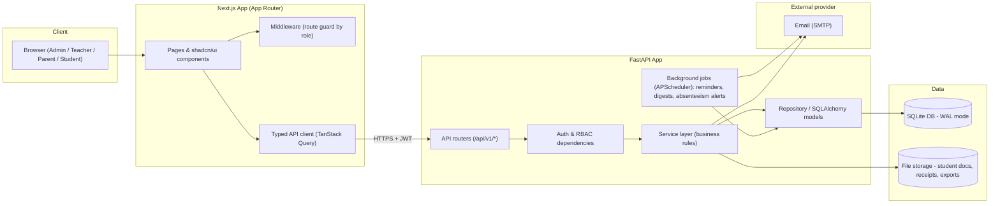

# 02 — System Architecture

## High-level component diagram



## Component responsibilities

### Frontend — Next.js
- **App Router** with route groups per role area, e.g. `(admin)`,
  `(teacher)`, `(parent)`, `(student)`, sharing a common `(auth)` group for
  login/forgot-password.
- **shadcn/ui strictly** — no other component library. Custom components are
  built by composing shadcn primitives (`Button`, `DataTable`, `Card`,
  `Dialog`, `Form`, `Sheet`, `Tabs`, etc.), themed via Tailwind tokens.
- **Server Components** for data-heavy read views (tables, reports),
  **Client Components** for interactive forms/dialogs.
- **Middleware** reads the JWT (from an httpOnly cookie) to gate routes by
  role before the page renders, in addition to server-side checks.
- **TanStack Query** for client-side data fetching/caching/mutations against
  the FastAPI backend; **React Hook Form + Zod** for form state/validation,
  with Zod schemas mirroring backend Pydantic schemas.

### Backend — FastAPI
- **Layered structure**: `routers` (HTTP concerns only) → `services`
  (business logic, transaction boundaries) → `repositories`/SQLAlchemy
  models (data access). Routers never talk to the DB directly.
- **Dependency-injected auth**: a `get_current_user` dependency decodes the
  JWT; a `require_permission("fees:create")`-style dependency enforces RBAC
  per route (see doc 04).
- **Pydantic v2 schemas** separate `Create` / `Update` / `Read` shapes per
  resource; these are the contract the frontend's Zod schemas mirror.
- **Background jobs** (APScheduler in-process, since SQLite + single
  instance doesn't need a distributed queue for v1) handle: fee due-date
  reminders, absenteeism digest generation, scheduled announcement
  dispatch, nightly report pre-computation.
- **Auto-generated OpenAPI docs** (`/docs`) double as the API contract for
  frontend integration.

### Data layer
- **SQLite** in WAL (Write-Ahead Logging) mode for better read concurrency.
  A single DB file for the one school this instance serves — there is no
  `school_id` column and no per-school partitioning anywhere in the
  schema (this is a single-school system, not a multi-tenant one).
  Alembic manages schema migrations.
- **File storage**: local filesystem under a managed `storage/` directory
  for v1 (student documents, generated receipts/PDFs, report card exports),
  organized by `entity/id/`. Abstracted behind a small storage interface so
  it can move to S3-compatible storage later without touching callers.

### External provider
- **Email**: SMTP client (e.g. an async SMTP library) behind a
  `NotificationChannel` interface. This is the only external
  notification channel — notifications are in-app and email, there is
  no SMS gateway in this system.
- Called only from the **service layer** via the notification service
  (doc 10), never directly from routers.

## Request flow (typical read/write)

1. Browser calls the Next.js API client → FastAPI route.
2. Route resolves the current user from the JWT (`get_current_user`).
3. A permission dependency checks the user's role/permissions against the
   route's required permission; data-scoping rules (e.g. "parent → only own
   children") are applied in the service layer using the resolved user.
4. Service layer executes business logic inside a DB transaction, using
   repositories/SQLAlchemy for persistence.
5. Response is serialized through a Pydantic `Read` schema and returned in
   the standard envelope (doc 06).
6. Sensitive writes (payments, grade changes, attendance edits) are also
   written to an `audit_logs` table by the service layer.

## Auth flow

- **Login**: `POST /api/v1/auth/login` with email/username + password →
  verifies password hash → issues a short-lived **access token** (JWT, ~15
  min) and a longer-lived **refresh token** (httpOnly, secure cookie, ~7
  days, rotated on use).
- **Session refresh**: `POST /api/v1/auth/refresh` rotates the refresh
  token and issues a new access token; refresh-token reuse detection
  revokes the whole token family (protects against stolen-cookie replay).
- **Logout**: revokes the refresh token server-side (a `refresh_tokens`
  table tracks active/revoked tokens, not just stateless JWTs, so logout
  and forced revocation actually work).
- **Password reset**: time-limited signed token emailed to the user;
  reset invalidates all existing refresh tokens for that account.
- **First login for staff/parents created by admin**: account created with
  a temporary password/invite link, forced password change on first login.

## Repository / folder structure

```
edumanage/
├── docs/                      # this folder — the plan
├── backend/
│   ├── app/
│   │   ├── main.py
│   │   ├── core/              # config, security, JWT, permissions registry
│   │   ├── db/                # SQLAlchemy session, base, Alembic env
│   │   ├── models/             # SQLAlchemy models, grouped by domain
│   │   ├── schemas/            # Pydantic schemas, grouped by domain
│   │   ├── routers/            # API routers, grouped by domain
│   │   ├── services/           # business logic per domain
│   │   ├── jobs/                # APScheduler jobs
│   │   └── tests/
│   ├── alembic/
│   └── pyproject.toml
├── frontend/
│   ├── app/
│   │   ├── (auth)/
│   │   ├── (admin)/
│   │   ├── (teacher)/
│   │   ├── (parent)/
│   │   ├── (student)/
│   │   └── api/                # (only if any Next.js route handlers are needed, e.g. auth callbacks)
│   ├── components/
│   │   ├── ui/                 # shadcn generated primitives
│   │   └── shared/              # composed, app-specific components
│   ├── lib/                     # api client, auth helpers, zod schemas
│   ├── hooks/
│   └── package.json
└── README.md
```

- Both `backend/` and `frontend/` are grouped **by domain** (student,
  fees, attendance, communication, academics, examinations, staff), not by
  technical layer, so a module's code stays close together across
  models/schemas/routers/services and across app route groups/components.

## Environments

| Env | Purpose | DB | Notes |
|---|---|---|---|
| Local dev | Feature development | `dev.db` (SQLite file, gitignored) | Seed script for demo data |
| Staging | UAT with the school before go-live | separate SQLite file | Mirrors prod config |
| Production | Live school data | SQLite file on persistent volume + scheduled backups | Automated nightly backup + WAL checkpoint (doc 15) |

## Code reuse — shared building blocks

Seven modules is a lot of surface area to keep consistent by discipline
alone, so reuse is structural, not just a coding guideline:

- **Backend — generic repository/service base classes.** A
  `BaseRepository[Model]` (list/get/create/update/soft-delete with
  pagination + filtering built in) and a `BaseService[Model]` are
  implemented once in `app/core/` and subclassed per resource. A module's
  repository/service only adds what's actually different (e.g. the fee
  ledger's balance math), never re-implements pagination or soft-delete.
- **Backend — one bulk-entry pattern, two call sites.** Attendance marking
  (doc 09) and assessment/exam score entry (docs 11–12) are structurally
  the same operation: "for every student in a roster, upsert one row
  against a parent session/assessment record." Both are implemented on
  top of a single shared `bulk_upsert_for_roster(...)` service helper
  instead of two parallel implementations.
- **Backend — one audit/soft-delete mixin.** `id`, `created_at`,
  `updated_at`, `created_by`, `is_active` are a SQLAlchemy declarative
  mixin applied to every model, and `AuditService.record(...)` is the
  single call site every write path uses to log to `audit_logs` (doc 14)
  — no module writes its own ad hoc audit logic.
- **Backend — one notification call site.** Every module that needs to
  notify someone (fee reminder, absenteeism alert, result published)
  calls the same `NotificationService.send(...)` (doc 10) rather than
  each module growing its own emailing logic.
- **Frontend — one DataTable + filter bar.** Every list screen (students,
  staff, invoices, payments, attendance records, notifications) is built
  from one shared `<DataTable>` component (server-side pagination/sort)
  paired with one shared `<FilterBar>` component that renders filter
  controls from a declarative field config, instead of each screen
  hand-building its own table and filter UI.
- **Frontend — one bulk-entry grid.** The roster-style "mark everyone,
  then adjust exceptions" UI is one shared component
  (`<RosterBulkGrid>`), reused for attendance marking and for
  gradebook/exam score entry — same interaction pattern on both ends.
- **Frontend — one typed form pattern.** Every create/edit form pairs a
  Zod schema with `React Hook Form` and shadcn `Form` primitives via one
  shared `useEntityForm()` hook, so validation/error-display wiring isn't
  reimplemented per form.
