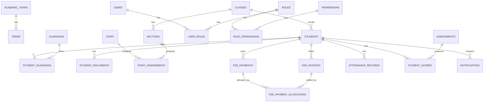

# 05 — Database Schema

Field lists below are the planned columns, not final DDL — types/constraints
are finalized when the module is implemented (see `tasks.md`). All tables
implicitly include the common columns from doc 03: `id`, `created_at`,
`updated_at`, `created_by`, `is_active`, unless noted. This is a
single-school system, so there is no `school_id` on any table.

## Domain grouping

## 1. Identity & Access

- **school_settings** *(singleton — exactly one row)* — `name`, `address`,
  `phone`, `email`, `logo_url`, `timezone`, `current_academic_year_id`.
  Holds the school's own profile/branding and global config; not a
  multi-tenant "schools" table, just the one row this instance runs for.
- **system_settings** — `key` (unique), `value`, `value_type`
  (`string`/`integer`/`boolean`/`decimal`), `category` (which module it
  belongs to, for grouping in the admin UI), `description`,
  `updated_by`, `updated_at`. **This is the concrete home for every
  "configurable" business rule mentioned across docs 04–15** — it exists
  specifically so "configurable" is a real, admin-editable database row
  and not just a promise in prose. Key-value rather than dedicated
  columns so a new setting is a data row, not a migration. Known keys
  at launch (each with a sensible default, all editable via the Admin
  "System Settings" screen — doc 04):

  | Key | Default | Category | Doc |
  |---|---|---|---|
  | `currency_code` | `USD` (see doc 01 "Regional context") | Finance | 08 |
  | `fee_discount_approval_threshold_cents` | school-confirmed (doc 18 §B) | Finance | 08 |
  | `attendance_edit_lock_hours` | `24` | Attendance | 09 |
  | `absenteeism_consecutive_absences_trigger` | `3` | Attendance | 09 |
  | `absenteeism_rate_trigger_pct` | school-confirmed | Attendance | 09 |
  | `academic_at_risk_threshold_pct` | school-confirmed | Academics | 11 |
  | `class_ranking_enabled` | `false` | Academics | 12 |
  | `teacher_fee_status_visibility` | `false` | Fees/Privacy | 04/08 |
  | `password_min_length` | `10` | Security | 14 |
  | `backup_retention_daily_days` / `backup_retention_weekly_weeks` | `30` / `26` | Ops | 15 |

  Values needing a real school-confirmed number (not just a code
  default) are tracked in doc 18 §B until set.
- **users** — `email`, `phone`, `password_hash`, `status`
  (`active`/`invited`/`locked`/`disabled`), `must_change_password`,
  `last_login_at`, `failed_login_count`.
- **roles** — `code`, `name`, `description`, `is_system_role` (seeded roles
  from doc 04 cannot be deleted, only have permissions adjusted).
- **permissions** — `code` (`module:action`), `description`.
- **role_permissions** — (`role_id`, `permission_id`).
- **user_roles** — (`user_id`, `role_id`).
- **refresh_tokens** — `user_id`, `token_hash`, `family_id`, `issued_at`,
  `expires_at`, `revoked_at`, `replaced_by_id` — supports rotation +
  reuse-detection + forced logout (doc 02).
- **audit_logs** — `actor_user_id`, `action`, `entity_type`, `entity_id`,
  `before` (JSON), `after` (JSON), `ip_address`, `created_at`.

## 2. Academic calendar & structure (shared foundation)

- **academic_years** — `name` (e.g. "2026"), `start_date`, `end_date`,
  `is_current`. Creating an academic year **pre-fills a 3-term template**
  (Term 1/Term 2/Term 3, matching standard Zimbabwean practice — doc 01
  "Regional context") as a convenience default, via full `terms` CRUD
  endpoints — not an automatic, uneditable side effect.
- **terms** — `academic_year_id`, `term_number` (display/sort order,
  not a fixed enum), `name` (editable — defaults to "Term 1"/"Term 2"/
  "Term 3" from the template but can be renamed), `start_date`,
  `end_date`, `is_current`. **Terms are fully admin-configurable**: add,
  rename, edit dates, or delete (if unused by any invoice/attendance/
  assessment record — doc 08/09/11 all reference `term_id`, so a term in
  use is protected from deletion the same way any referenced record
  would be). There is no hardcoded "always exactly 3" rule — the 3-term
  template is a seed convenience, not a constraint enforced afterward.
- **classes** — `name` (e.g. "Grade 1" … "Grade 7" — this school runs
  Grades 1–7), `level_order` (for sorting; matches the grade number).
  Admin-managed CRUD — same as terms, nothing about the grade range is
  hardcoded; the school's actual grades are captured as setup data
  (doc 18 §A).
- **sections** — `class_id`, `name` (e.g. "Grade 1 A", "Grade 1 B" — a
  grade can have more than one section/stream, each a genuinely
  separate class with its own roster, teacher, and attendance/grade
  records), `capacity`. No `class_teacher_staff_id` field here —
  `staff_assignments` (doc 05 §4) is the single source of truth for
  which teacher owns a section, so there's no second, denormalized
  pointer that could drift out of sync with it.
- **subjects** — `name`, `code`, `is_elective`.
- **class_subjects** — (`section_id`, `subject_id`) — which subjects are
  taught in which section, this term.

## 3. Student Information (doc 07)

- **students** — `user_id` (nullable — young students may not need login),
  `admission_no` (unique), `first_name`, `last_name`,
  `date_of_birth`, `gender`, `photo_url`, `current_section_id`,
  `enrollment_status` (`active`/`graduated`/`transferred_out`/`withdrawn`),
  `admission_date`, `blood_group`, `medical_notes`, `nationality`.
- **guardians** — `user_id` (nullable until portal access granted),
  `first_name`, `last_name`, `relationship`, `phone`, `email`,
  `occupation`, `address`, `is_emergency_contact`.
- **student_guardians** — (`student_id`, `guardian_id`), `is_primary`,
  `is_billing_contact`, `can_pickup`.
- **student_documents** — `student_id`, `doc_type` (birth cert, ID,
  transfer letter, immunization, etc.), `file_url`, `uploaded_by`,
  `verified_at`.
- **student_academic_history** — `student_id`, `academic_year_id`,
  `section_id`, `promotion_status` (`promoted`/`repeated`/`transferred`),
  `remarks` — one row per year, the audit trail of where a student sat
  each year.

## 4. Staff Management (doc 13)

- **staff** — `user_id`, `employee_no`, `first_name`, `last_name`,
  `department`, `designation` (e.g. "Teacher", "Head of Dept"),
  `qualification`, `date_joined`, `employment_status`
  (`active`/`on_leave`/`terminated`), `phone`, `email`.
- **staff_assignments** — `staff_id`, `section_id`, `academic_year_id`,
  `term_id`. **No `subject_id` and no role distinction** — this system's
  staffing model is one teacher per class teaching every subject in it
  (doc 01/13), so an assignment is simply "this teacher owns this class
  this term," full stop. Two constraints enforced at the service layer:
  a section has at most one active assignment per term (a class has
  exactly one teacher), and a staff member has at most one active
  assignment per term (a teacher has exactly one class).
- **staff_attendance** — `staff_id`, `date`, `status`
  (`present`/`absent`/`leave`/`half_day`), `check_in_time`,
  `check_out_time`, `marked_by`.
- **staff_documents** — `staff_id`, `doc_type`, `file_url`.

## 5. Fee & Financial Management (doc 08)

- **fee_categories** — `name`, `is_recurring`. Fully admin-editable CRUD;
  seeded at setup with a starter list grounded in common Zimbabwean
  school levies (doc 01 "Regional context") — Tuition, Development
  Levy, PTA/SDC Contribution, Sports Levy, ICT Levy, Examination Fee
  (relevant for the Grade 7 cohort) — which Admin can rename, remove, or
  add to freely; nothing about this list is fixed.
- **fee_structures** — `academic_year_id`, `term_id` (one of that year's
  configured terms — see §2, not assumed to always be exactly 3),
  `section_id` (nullable = applies to a whole class/level), `class_id`,
  `fee_category_id`, `amount_cents`, `due_date`.
- **student_fee_overrides** — `student_id`, `fee_structure_id`,
  `override_amount_cents`, `reason` — for individual adjustments outside
  a general discount.
- **discounts** — `name`, `type` (`percentage`/`fixed`), `value`,
  `applies_to` (`category`/`structure`/`student`), `requires_approval`,
  `approval_threshold_cents`.
- **student_discounts** — `student_id`, `discount_id`, `approved_by`,
  `approved_at`, `status` (`pending`/`approved`/`rejected`).
- **fee_invoices** — `student_id`, `term_id`, `fee_structure_id`,
  `amount_due_cents`, `credit_applied_cents` (how much of this invoice
  was settled by carried-forward credit from `fee_credits`, see below),
  `amount_paid_cents` (sum of this invoice's `fee_payment_allocations`;
  denormalized running total), `status`
  (`unpaid`/`partial`/`paid`/`overdue`/`waived`), `due_date`.
  Outstanding balance for an invoice is `amount_due_cents -
  credit_applied_cents - amount_paid_cents` and can be **positive**
  (underpaid — e.g. $50 due, $30 paid → $20 balance, status `partial`)
  just as normally as it can reach zero; always reconstructable from
  `fee_ledger` if these denormalized fields ever drift.
- **fee_payments** — `student_id`, `amount_cents`, `method`
  (`cash`/`bank_transfer`/`mobile_money`/`cheque`/`card`), `reference_no`,
  `paid_at`, `received_by_staff_id`, `notes`. A payment is recorded
  against the **student**, not a single invoice directly — how it's
  divided across the student's invoices is `fee_payment_allocations`.
  This is what lets one payment naturally do the right thing whether the
  student is catching up on an old balance, paying the current term
  exactly, or paying ahead.
- **fee_payment_allocations** — `fee_payment_id`, `fee_invoice_id`,
  `amount_cents` — how one payment is split across one or more invoices.
  **Default allocation order is oldest-outstanding-invoice-first** (by
  `due_date`/`term_number`): a payment first tops up any earlier term's
  partial balance before counting toward the current or a future term.
  Accountant can override the split manually (e.g. to target one
  category's invoice specifically) instead of accepting the automatic
  oldest-first order. Any amount left over after every outstanding
  invoice is fully covered becomes a `fee_credits` row rather than being
  rejected or discarded — see below.
- **fee_credits** — `student_id`, `source_payment_id` (the payment whose
  leftover, after settling all outstanding invoices oldest-first,
  generated it), `originating_term_id`, `amount_cents`,
  `amount_remaining_cents`, `status`
  (`available`/`partially_applied`/`fully_applied`/`refunded`) —
  represents fee **overpayment carried forward**, so it can be applied
  against a *later* term's invoice for the same student (see doc 08 for
  the apply/refund workflow). Because allocation is always
  oldest-first, a credit can only ever exist once every earlier
  invoice — including any underpaid one — is fully settled; an
  underpaid Term 1 and a "credit" from Term 2 can never coexist for the
  same student.
- **fee_credit_applications** — `fee_credit_id`, `fee_invoice_id`,
  `amount_cents`, `applied_at`, `applied_by_staff_id` (nullable when
  auto-applied by the system at next-term invoice generation) — the
  audit trail of which credit paid for which later invoice; a single
  credit can be split across multiple invoices/terms if it's larger than
  one term's balance.
- **receipts** — `payment_id`, `receipt_no` (sequential), `pdf_url`,
  `issued_at`.
- **fee_ledger** — `student_id`, `entry_type` (`charge`/`payment`/
  `discount`/`refund`/`adjustment`/`credit_issued`/`credit_applied`/
  `credit_refunded`), `amount_cents`, `balance_after_cents`,
  `reference_id`, `reference_type`, `term_id` (nullable — set for
  term-scoped entries, enabling the per-term history below),
  `created_at` — append-only ledger, the authoritative source for
  "outstanding balance" and for the **per-term paid/due/credit/balance
  breakdown** described in doc 08 (never trust a mutable running total
  alone; the ledger can always reconstruct both the overall balance and
  the Term 1 / Term 2 / Term 3 history).

## 6. Attendance Management (doc 09)

- **attendance_sessions** — `section_id`, `subject_id` (nullable for
  whole-day homeroom attendance vs per-period), `date`, `period`,
  `taken_by_staff_id`, `locked_at` (attendance becomes immutable after a
  configurable window, edits after that require an audited override).
- **attendance_records** — `session_id`, `student_id`, `status`
  (`present`/`absent`/`late`/`excused`/`half_day`), `remarks`.
- **attendance_daily_summary** *(materialized/derived table, refreshed by
  a background job)* — `student_id`, `date`, `overall_status` — collapses
  multiple periods into one daily status for reporting.
- **absenteeism_flags** — `student_id`, `term_id`, `consecutive_absences`,
  `attendance_rate`, `flagged_at`, `notified_at` — output of the
  absenteeism-detection job (doc 09), feeds doc 10 notifications.

## 7. Communication & Notifications (doc 10)

- **notification_templates** — `code`, `channel` (`in_app`/`email`),
  `subject_template`, `body_template`, `category` (fees/attendance/
  academics/announcement/event).
- **notifications** — `recipient_user_id`, `template_code`, `title`,
  `body`, `channel`, `status` (`queued`/`sent`/`failed`/`read`),
  `related_entity_type`, `related_entity_id`, `sent_at`, `read_at`.
- **announcements** — `title`, `body`, `audience` (`all`/`role`/`section`/
  `individual`), `audience_filter` (JSON), `published_by`, `published_at`,
  `expires_at`.
- **events** — `title`, `description`, `location`, `start_at`, `end_at`,
  `audience`, `audience_filter`.
- **notification_preferences** — `user_id`, `category`, `channel`,
  `enabled` — per-user opt-in/out per channel per category (subject to
  school-level mandatory categories that can't be muted, e.g. fee overdue).

## 8. Academic Performance & Examinations (docs 11–12)

- **grading_scales** — `name`, `min_score`, `max_score`, `letter_grade`
  (free-text label — holds a traditional letter *or* a descriptive band
  like "Meets Expectation", not restricted to A–F; doc 01 "Regional
  context" notes Zimbabwe's competency-based curriculum commonly uses
  descriptive bands at primary level), `gpa_points`, `description` —
  grouped by `grading_scale_set_id` so a school can define multiple
  scales if needed. Fully admin-editable; no default band set is
  hardcoded into the schema.
- **assessment_types** — `name`, `default_weight_pct`. Admin-editable
  CRUD, seeded with a starter set grounded in the CALA-informed
  continuous-assessment model (doc 01) — e.g. "CALA Task", "End of Term
  Test" — alongside a generic quiz/assignment/project set, all
  freely renamed or replaced.
- **assessments** — `section_id`, `subject_id`, `term_id`,
  `assessment_type_id`, `name`, `max_score`, `weight_pct`, `date`,
  `created_by_staff_id`.
- **student_scores** — `assessment_id`, `student_id`, `score_obtained`,
  `is_absent`, `comments`, `graded_by_staff_id`, `graded_at`.
- **exams** — `term_id`, `name` (e.g. "Mid-Term Exam"), `exam_type`
  (formative/summative), `status` (`scheduled`/`ongoing`/`completed`/
  `published`).
- **exam_schedules** — `exam_id`, `section_id`, `subject_id`, `date`,
  `start_time`, `end_time`, `max_score`, `room`.
- **exam_results** — `exam_schedule_id`, `student_id`, `score_obtained`,
  `grade` (derived from `grading_scales`), `is_absent`, `remarks`.
- **report_cards** — `student_id`, `term_id`, `generated_at`,
  `compiled_by_staff_id` (class teacher), `status` (`draft`/`reviewed`/
  `published`), `overall_grade`, `class_rank` (nullable/configurable),
  `attendance_summary_snapshot`, `pdf_url`.
- **report_card_comments** — `report_card_id`, `subject_id` (nullable for
  an overall comment), `author_staff_id`, `comment`.

## Indexing strategy

- Every foreign key gets an index (SQLite doesn't auto-index FKs).
- Composite indexes for the query patterns that will dominate traffic:
  `(section_id, date)` on `attendance_sessions`, `(student_id, term_id)`
  on `fee_invoices` and `student_scores`, `(status)` on `notifications`.
- `admission_no` and `employee_no` get unique indexes.
- The append-only `fee_ledger` is indexed on `(student_id, created_at)`
  and `(student_id, term_id)` — the latter is what makes the per-term
  (Term 1/2/3) fee history view fast.
- `fee_credits` is indexed on `(student_id, status)` so "does this
  student have unapplied credit" is a cheap lookup at invoice-generation
  time.
- `fee_payment_allocations` is indexed on `(fee_invoice_id)` (rolling up
  an invoice's paid amount) and `(fee_payment_id)` (showing how one
  payment was split), and `fee_invoices` on `(student_id, due_date)` for
  the oldest-outstanding-first allocation query.

## Migration & seed strategy

- Alembic autogenerate + manual review for every schema change; migrations
  are named `NNNN_description` and reviewed like any other code change.
- A seed script creates: the 8 roles with their default permission sets
  (doc 04), a demo academic year/term/class/section, and a demo Admin user
  — used for local dev and for the school's own initial setup wizard.
