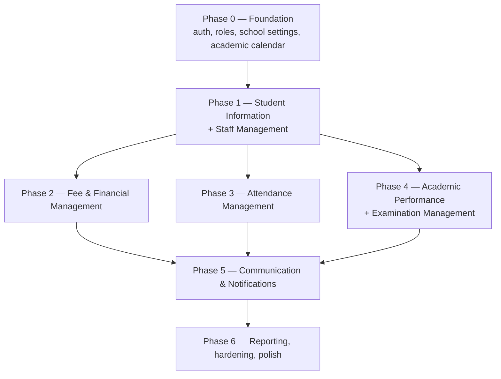

# 16 — Implementation Roadmap

## Ordering rationale

The 7 objectives are numbered by business priority, but **build order
follows data dependency, not business priority** — several modules key off
Student Information and Staff Management, so those are built first even
though "Fees" is objective #1. Building fees before students exist to bill
would mean mocking the very foundation the module needs.

## Phase 0 — Foundation

**Goal:** nothing school-specific yet, but every later module depends on
this being right.

- Project scaffolding: `backend/` FastAPI app, `frontend/` Next.js app,
  shared tooling (lint/format/CI) per doc 03.
- `school_settings`, `academic_years`, `terms`, `classes`, `sections`, `subjects`
  tables + admin CRUD (the shared calendar/structure, doc 05 §2).
- Identity & access: `users`, `roles`, `permissions`, `user_roles`,
  `role_permissions`, `refresh_tokens`, auth endpoints (login/refresh/
  logout/password reset), RBAC dependency layer (doc 04).
- `audit_logs` table + the write-path convention (doc 06/14) established
  once, reused by every later module.
- Base frontend shell: layout per role area, auth pages, protected
  routing middleware, the typed API client pattern, shadcn/ui installed
  and themed.
- Seed script (demo school, roles, admin user).

## Phase 1 — Student Information + Staff Management

**Goal:** the two "who" foundations everything else references.

- Doc 07 in full: registration, guardians, documents, class allocation,
  withdrawal/transfer, student profile view.
- Doc 13 in full: staff records, assignments, staff attendance,
  documents.
- These ship together because `staff_assignments` (who can act on which
  section/subject) gates permission checks in every module from Phase 3
  onward.

## Phase 2 — Fee & Financial Management (Objective 1)

- Doc 08 in full: categories, structures, invoice generation, payments,
  receipts, discounts (with approval workflow), ledger, financial
  reports, parent-facing balance view.
- Deliberately placed right after the student foundation since it's the
  #1 stated objective and only depends on Phase 1.

## Phase 3 — Attendance Management (Objective 2)

- Doc 09 in full: session-based marking, daily summaries, locking,
  absenteeism detection job, excuse requests, reports.
- Depends only on Phase 1 (students, staff assignments); independent of
  Phase 2, so Phases 2 and 3 could in principle run in parallel with two
  developers — sequenced here for a single-track plan.

## Phase 4 — Academic Performance + Examination Management (Objectives 5 & 6)

- Doc 11: assessments, gradebook, coursework scores, at-risk detection.
- Doc 12: exam scheduling, mark entry, publish workflow, report card
  compilation and publish.
- Grouped into one phase because they share `grading_scales` and the
  report card pulls from both — building them together avoids
  integration rework.

## Phase 5 — Communication & Notifications (Objective 3)

- Doc 10 in full: notification center, announcements, events,
  preferences, and — critically — wiring the **triggers** from every
  prior module (fee reminders, absenteeism alerts, result/report-card
  publish notices).
- Placed after the modules it notifies *for* so the trigger integrations
  are built against real, finished features rather than speculative
  hooks.

## Phase 6 — Reporting, hardening, polish

- Cross-module dashboards (Principal/Admin school-wide view pulling
  summary data from every module).
- Full pass against doc 14 (security checklist) and doc 15
  (non-functional requirements) as explicit verification, not just
  "hopefully covered along the way."
- Performance pass on list/report endpoints at realistic data volumes.
- Accessibility pass on core workflows.
- UAT with the school on staging, backup/restore drill.

## Fast-follow candidates (post-v1, not blocking launch)

- Live payment gateway checkout (v1 ships manual payment recording +
  parent-submitted "I paid" reconciliation — see doc 08).
- Native mobile app (responsive web covers v1).
- Attendance/performance correlation analytics (noted as a v2 idea in
  doc 09).

## How this maps to `tasks.md`

`tasks.md` breaks each phase above into checkable tasks, grouped the same
way (Phase 0 → Phase 6), so progress against this roadmap is trackable
task-by-task rather than only at the phase level.
